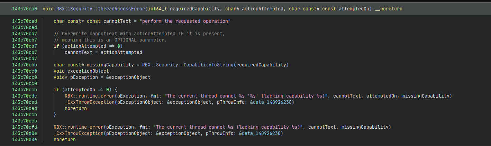

# Luau API Security

ROBLOX limits what Lua states (referred to as `Luau Threads` from here) can do in the Roblox environment.

They limit this by setting special flags in two places:

* Luau Protos' Userdata pointer
* Luau Threads Userdata pointer (referred to as `RobloxExtraSpace`from here)

The Luau Proto Userdata is a pointer to an `std::int64_t`object. This pointer houses the capabilities that the function has; this value is used with the Luau Thread capability to check the capabilities that the Luau Thread and the Luau Proto share. Think of it as intersecting the values to check which values both the Luau Proto and the Luau Thread have.


Function to perform an intersection between the flags of the Luau Thread and the Luau Proto in ROBLOX Studio (Pre RemoteEvent Security Update)

The comments explain what the code does, but in a nutshell:

* It returns the capability that both the thread and the proto have. This allows for patterns such as elevating a thread to max privileges but limiting what can be executed by setting the proto's userdata.

The code above performs a binary **AND** operation and returns the bits that are the same.

### Why is this significant?

This feature is a rework from ROBLOX's previous security, Identities. The rework allows for a more flexible system, allowing for up to 64 different capabilities, one for every bit of the number (the size of an `std::int64_t`) This allows Roblox to have a more flexible system without losing any of the previous security. It aids the fact that the capabilities need modification in two different places, making them more annoying to exploit, requiring **Luau VM Shuffles** and **Luau VM Encryptions** to gain elevated access in an easier manner. overall, a win-win, since they have a more flexible system whilst making elevating exploits more annoying.

Roblox has maintained some level of compatibility with the old Identity system by making a function to 'translate' the new Capabilities from a given Roblox Identity; the pseudocode below does that:


ROBLOX's Identity to Capability function in ROBLOX Studio (Pre RemoteEvent Security Update)

Each of these bits on the returned value means something; one grants access to `RunServerScript`, another grants access to `LoadString`, and some others grant access to `Plugin` capabilities, which is what most exploiters desire.

***

Roblox raises a C++ exception, which is sent to Luau by their exception handler when the capability checks fail. The error function can be found using the string, `The current thread cannot %s '%s' (lacking capability %s)`, only present in ROBLOX Studio; the format string already lets in some detail, but what we want to know, though, is what bit means what in the capabilities`long long`; the last placeholder for the format string may have what we desire.



ROBLOX's threadAccessError function in ROBLOX Studio (Pre RemoteEvent Security Update)

ROBLOX has a flexible API that allows them to perform security checks on their C API functions. The function above is in charge of dispatching a C++/Cxx exception when the`requiredCapability`is not found. `requiredCapability` is required to do the action, this value is passed into another function, which converts the flag into a string representation. The function consists of an immense chain of if statements containing bit tests and binary **AND** checks. These, if successful, return the name of the capability that the Luau Thread (or the Luau Proto) is lacking.


ROBLOX's CapabilityToString function in ROBLOX Studio (Pre RemoteEvent Security Update)

As seen in the pseudocode above, the `requiredCapability` is tested for non-zero; this means that the capability that we are after is that one; this is due to how flags are checked. An example has been provided below for anyone who has not EVER done such, although it is fairly normal to do so.

```cpp
enum Example {
    HelloFlag = 0x1,        // 0b1
    BritainFlag = 0x2,      // 0b10
    USFlag = 0x4,           // 0b100
};
// ...
auto exampleValue = Example::HelloFlag | Example::BritainFlag; // 0b1 | 0b10 => 0b11
// ...
if ((exampleValue & Example::HelloFlag) == Example::HelloFlag) { // (0b11 & 0b10 => 0b10) == 0b10 
    // exampleValue contains Example::HelloFlag!
}
```

Back into the main topic. We are checking the bits of the integer to provide the name of the capability they belong to. This lets us know what bit represents what and to get all of the capabilities.

Here is an example of what the `RBX::Security::Capabilities` enum may even look like before being lowered (pre-RemoteEvent security update):

```cpp
namespace RBX::Security {
    enum Capabilities : std::int64_t {
        Plugin             = 0b1,
        LocalUser          = 0b10,
        WritePlayer        = 0b100,
        RobloxScript       = 0b1000,
        RobloxEngine       = 0b10000,
        NotAccessible      = 0b100000,

        RunClientScript    = 0b10000000,
        RunServerScript    = 0b100000000,
        AccessOutsideWrite = 0b10000000000,

        Unassigned         = 0b100000000000000,
        AssetRequire       = 0b1000000000000000,
        LoadString         = 0b10000000000000000,
        ScriptGlobals      = 0b100000000000000000,
        CreateInstances    = 0b1000000000000000000,
        Basic              = 0b10000000000000000000,
        Audio              = 0b100000000000000000000,
        DataStore          = 0b1000000000000000000000,
        Network            = 0b10000000000000000000000,
        Physics            = 0b100000000000000000000000,
        UI                 = 0b1000000000000000000000000,
        CSG                = 0b10000000000000000000000000,
        Chat               = 0b100000000000000000000000000,
        Animation          = 0b1000000000000000000000000000,
        Avatar             = 0b10000000000000000000000000000,
        
        Assistant          = 0b10000000000000000000000000000000000000000000000000000000000000,
        
        // Restricted is a check below zero, meaning negative or, for lack of a better term, -1.
        Restricted         = 0xffffffffffffffff
    }
}; // namespace RBX::Security
```


### Remarks:

_This concludes all that I have been able to research around the new capabilities system. Please note that the given capabilities are not up to date!_

_ROBLOX has recently introduced four new capabilities that limit the accessibility into `RemoteEvent` and `RemoteFunction` Instances, which is why all images have been captioned, really clearly, with **`(Pre RemoteEvent Security Update)`**._

_It should be noted this is reverse engineering work; all said here can be ENTIRELY different from the implementation ROBLOX may have! Do not take anything seen here as a fact; always investigate on your own._

### Tools used:

* Binary Ninja Personal 4.1.5902-stable